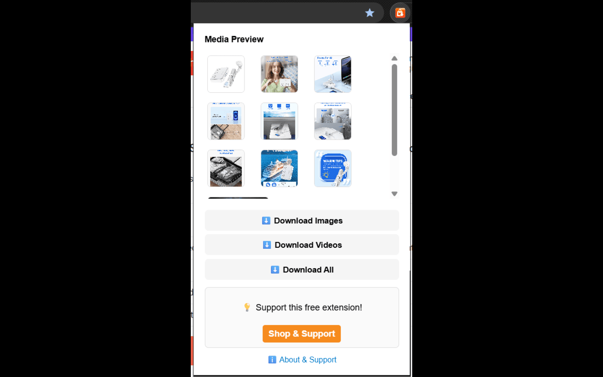
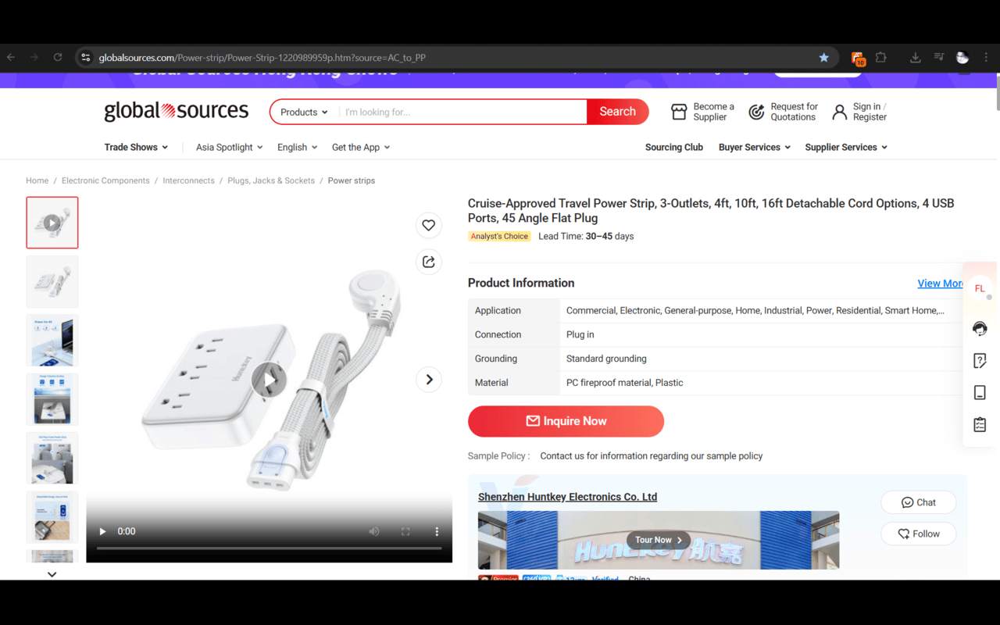
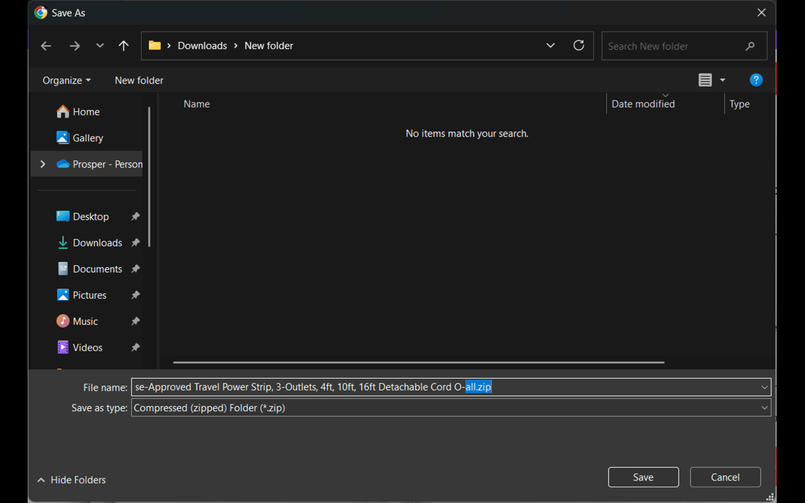
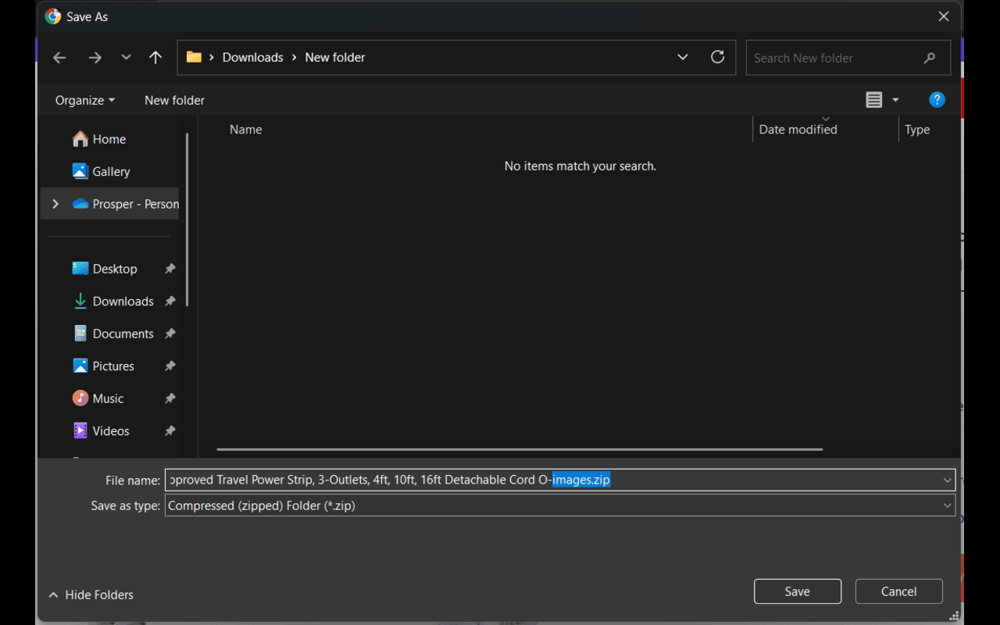
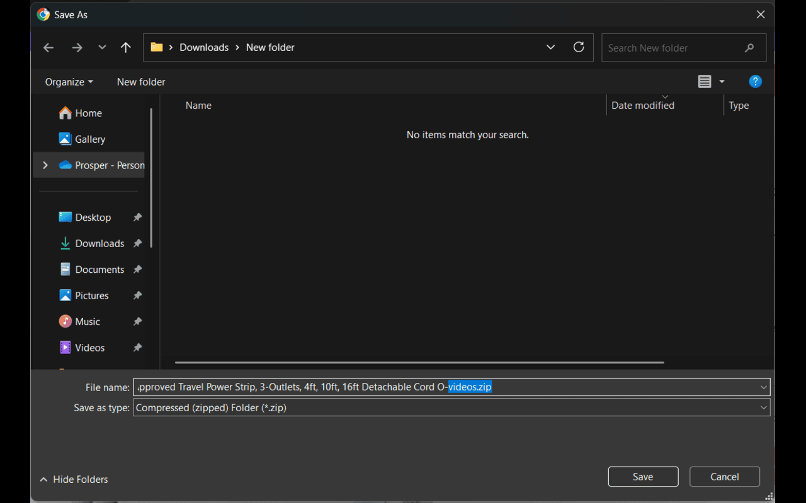

# GlobalSources Downloader Pro  

🚀 **GlobalSources Downloader Pro** is a free Chrome Extension that lets you **easily download images and videos** from GlobalSources product pages — all in one click. Save product media into neatly organized **ZIP files** for faster workflow, research, or offline use.  

👉 [Install from Chrome Web Store](https://chromewebstore.google.com/detail/GlobalSources-media-downloader/opbecmocliofeeooopdodcneelbconmp?authuser=0&hl=en-GB)

👉 [Install from Firefox Web Store](https://addons.mozilla.org/en-US/firefox/addon/GlobalSources-media-downloader-pro/)

---

## ✨ Features
- 🖼 **Download product images** in full resolution.  
- 🎥 **Download videos** directly from product listings.  
- 📦 **One-click ZIP export** – save all media at once.  
- 🔎 **Clean, simple preview** inside the extension popup.  
- 💡 Works seamlessly on most **GlobalSources product pages**.  

---

## 📸 Screenshots

### 🔹 Popup Overview
<figure>
  
  <figcaption><b>Popup Window:</b> The add-on popup when clicked.</figcaption>
</figure>

---

### 🔹 Product Media Previews
<figure>
  
  <figcaption><b>Product Media:</b> Images and videos detected on an GlobalSources product page.</figcaption>
</figure>

---

### 🔹 Download Options
<figure>
  
  <figcaption><b>Save All:</b> Download both images and videos in one ZIP file.</figcaption>
</figure>

<figure>
  
  <figcaption><b>Save Images:</b> Download product images only.</figcaption>
</figure>

<figure>
  
  <figcaption><b>Save Videos:</b> Download product videos only.</figcaption>
</figure>

---

## 🎬 Video Demo

### 📺 Walkthrough: Downloading GlobalSources Videos & Images
<figure>
  
  <figcaption><b>Video Demo:</b> Step-by-step guide showing how to use the extension.</figcaption>
</figure>

---

## 📥 How It Works
1. Open an GlobalSources product page.  
2. Click the **GlobalSources Downloader Pro** icon in Chrome.  
3. Preview all available images and videos.  
4. Choose: **Download Images**, **Download Videos**, or **Download All**.  
5. Files are saved instantly as a ZIP with the product title in the name.  

---

## 🔗 Support the Developer

This extension is free to use. To help keep it free, we may show an occasional sponsored link after downloads — clicking it supports ongoing development ❤️
Prefer to support directly? <a href="https://ko-fi.com/prablordeppey" target="_blank" rel="noopener noreferrer">Buy me a coffee on Ko-fi</a>.

---

## 📄 About
GlobalSources Downloader Pro was created to simplify the process of collecting product media for:  
- 🛒 Dropshippers  
- 📊 Market researchers  
- 📁 Collectors & archivists  

---

## 📝 License
© 2025 The Addon Forge. All rights reserved.  

This repository contains documentation and assets for **GlobalSources Downloader Pro**.  
The source code for the extension is proprietary and not covered by an open-source license.  
Usage, copying, or redistribution is not permitted without explicit permission.

---

## 📢 Keywords (SEO)
GlobalSources downloader, GlobalSources image downloader, GlobalSources video downloader, GlobalSources ZIP export, Chrome extension for GlobalSources, download GlobalSources product media
